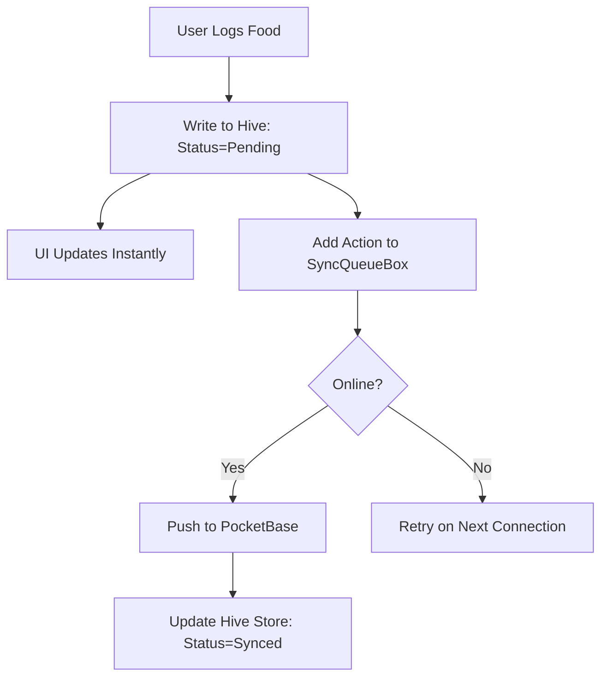

# Research Dimension: Architecture (2025)

## Component Boundaries

1.  **Presentation Layer (Riverpod)**: Listens to Hive streams. Never touches the Network layer directly.
2.  **Domain Layer**: Pure business logic (e.g., Calorie calculation, Dosha scoring weights).
3.  **Data Layer (Repository)**: Orchestrates between Hive (Local) and PocketBase (Remote).
4.  **Sync Engine**: A background service that monitors a `PendingSyncBox` in Hive and pushes updates to PocketBase using SSE (Server-Sent Events) or REST.

## Data Flow Pattern (Offline-First)

## Recommended Build Order

1.  **Core Sync Infrastructure**: Establish Hive ↔ PocketBase link with basic Auth.
2.  **Core Tracking**: Steps (Pedometer) and Water logging (simplest data types).
3.  **Nutrition Engine**: Food logging with Open Food Facts integration.
4.  **Ayurvedic Brain**: Dosha Quiz and recommendation logic.
5.  **Community & Karma**: Real-time social features.

## Critical Integration Points
- **PocketBase SSE**: Use real-time subscriptions for leaderboards and group challenges to avoid polling.
- **Hive Encryption**: Must encrypt `user_profile` and `medical_logs` boxes before any data is written.
